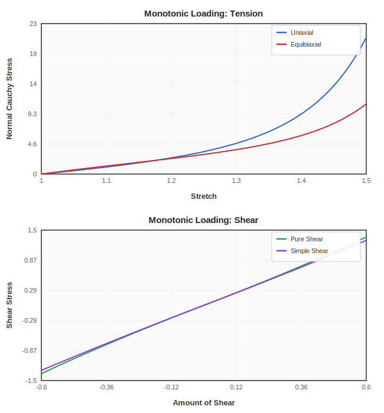
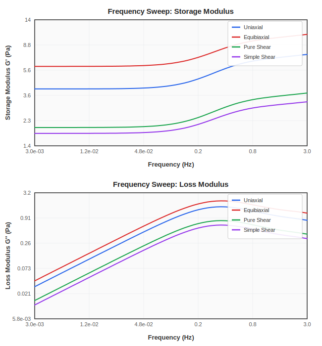
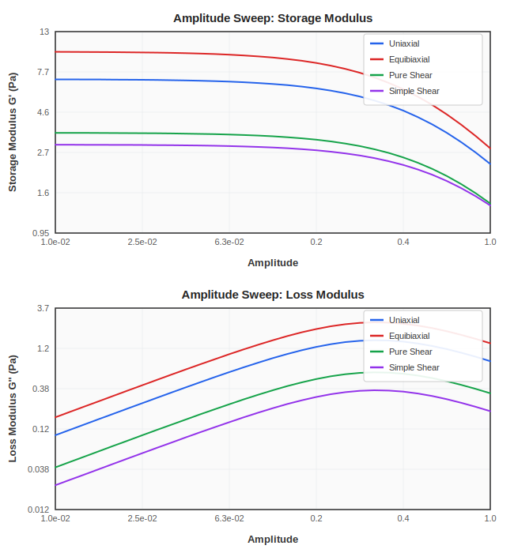
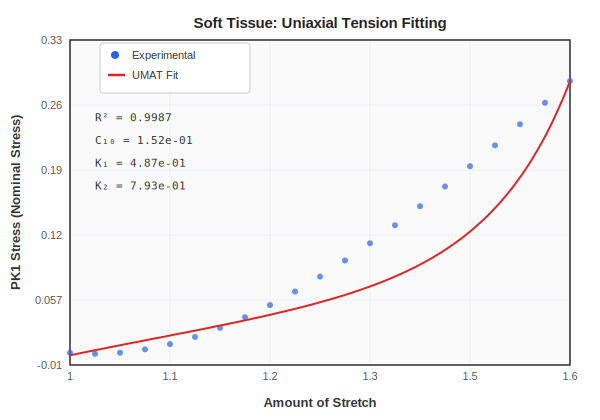
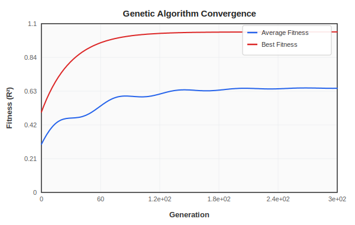

# UMAT Material Explorer

Explore constitutive material behavior under different loading scenarios and fit material parameters to experimental data. Works with any ABAQUS-compatible UMAT subroutine — no ABAQUS installation required.

Ships with a GHO (Generalized Humphrey-Ogden) viscoelastic UMAT as a working example. Replace it with your own UMAT to explore any material model.

## Prerequisites

- **gfortran** 7+ (or any Fortran compiler)
- **GNU Make**
- **gnuplot** (optional, for visualization)

## Quick Start

```bash
# Build all
make

# Run monotonic loading
make -C monotonic run

# Run cyclic loading
make -C cyclic run

# Run parameter fitting
make -C fitting run
```

---

## Loading Scenarios and Output Plots

### 1. Monotonic Loading (`monotonic/`)

Continuous loading to study stress-strain response under four deformation modes:

| Test | Deformation | Output File | Stress Component |
|------|-------------|-------------|------------------|
| Uniaxial tension | F(1,1) = lambda | `stress_curves/uniaxial.out` | Cauchy sigma_11 |
| Equibiaxial tension | F(1,1) = F(2,2) = lambda | `stress_curves/biaxial.out` | Cauchy sigma_11 |
| Pure shear | F(1,2) = F(2,1) = gamma | `stress_curves/shear.out` | Cauchy sigma_12 |
| Simple shear | F(1,2) = gamma | `stress_curves/s_shear.out` | Cauchy sigma_12 |

Stretch range: 1.0 to 1.5 (400 steps). Shear range: -0.6 to +0.6 (400 steps).

<p align="center">
  
</p>

**Top panel**: Normal Cauchy stress vs stretch for uniaxial and equibiaxial tension. The equibiaxial response is stiffer due to biaxial constraint.
**Bottom panel**: Shear stress vs amount of shear. Pure shear (symmetric F) produces higher stress than simple shear (asymmetric F).

---

### 2. Cyclic Loading — Frequency Sweep (`cyclic/`)

Oscillatory loading across 61 log-spaced frequencies (0.003 to 300 Hz) to extract viscoelastic properties. Fixed amplitude: 0.05 (stretch) / 0.3 (shear). Three full cycles per frequency point.

| Test | Summary Output | Individual Cycles |
|------|---------------|-------------------|
| Uniaxial | `stress_curves/freq_sweep/uniaxial.out` | `stress_curves/freq_sweep/uniaxial/[1-61].out` |
| Equibiaxial | `stress_curves/freq_sweep/biaxial.out` | `stress_curves/freq_sweep/equibiaxial/[1-61].out` |
| Pure shear | `stress_curves/freq_sweep/shear.out` | `stress_curves/freq_sweep/shear/[1-61].out` |
| Simple shear | `stress_curves/freq_sweep/sshear.out` | `stress_curves/freq_sweep/sshear/[1-61].out` |

Summary files contain: frequency, storage modulus G', loss modulus G'', tan(delta).

<p align="center">
  
</p>

**Top panel**: Storage modulus G' increases with frequency — the material stiffens at higher loading rates (classic viscoelastic behavior).
**Bottom panel**: Loss modulus G'' shows a peak at frequencies near 1/tau, where energy dissipation is maximum.

---

### 3. Cyclic Loading — Amplitude Sweep (`cyclic/`)

Oscillatory loading across log-spaced amplitudes at fixed frequency (1 Hz). Three full cycles per amplitude point.

| Test | N amplitudes | Summary Output | Individual Cycles |
|------|-------------|---------------|-------------------|
| Uniaxial | 31 | `stress_curves/amp_sweep/uniaxial.out` | `stress_curves/amp_sweep/uniaxial/[1-31].out` |
| Equibiaxial | 31 | `stress_curves/amp_sweep/biaxial.out` | `stress_curves/amp_sweep/equibiaxial/[1-31].out` |
| Pure shear | 21 | `stress_curves/amp_sweep/shear.out` | `stress_curves/amp_sweep/shear/[1-21].out` |
| Simple shear | 21 | `stress_curves/amp_sweep/sshear.out` | `stress_curves/amp_sweep/sshear/[1-21].out` |

<p align="center">
  
</p>

**Top panel**: Storage modulus G' decreases with increasing amplitude — characteristic nonlinear softening (Payne effect in soft tissues).
**Bottom panel**: Loss modulus G'' varies with amplitude, reflecting amplitude-dependent dissipation.

---

### 4. Parameter Fitting (`fitting/`)

Genetic algorithm (SGA) fits elastic material parameters to experimental uniaxial stress-strain data from `soft_tissue.csv`.

**Fitted parameters** (bounds defined in `ga.inp`):

| Parameter | Description | Search Range |
|-----------|-------------|-------------|
| C10 | Neo-Hookean coefficient | 0 - 12 |
| K1 | HGO fiber stiffness | 0 - 12 |
| K2 | HGO fiber nonlinearity | 0.0001 - 4 |
| kappa | Fiber dispersion | 0.001 (fixed) |

**GA configuration**: Population 5, up to 301 generations, micro-GA with elitism.

**Fitness metric**: R^2 coefficient of determination.

<p align="center">
  
</p>

Experimental data points (uniaxial tension) overlaid with the best-fit UMAT prediction. The fitted model captures the nonlinear stiffening characteristic of soft biological tissues.

**Output files**:
- `plot_.out` — stretch, experimental stress, predicted stress
- `plot_r2.out` — R^2 value and best-fit parameters
- `plot_ga.out` — GA convergence history (generation, average fitness, best fitness)

<p align="center">
  
</p>

Typical convergence behavior: rapid improvement in early generations, plateauing as the population converges to the optimum.

---

## Using Your Own UMAT

The test drivers call the standard ABAQUS `subroutine umat(...)` interface. To use a different material model:

1. Replace `umat/umat.for` with your UMAT source (keep the same filename, or update the Makefiles)
2. Update `umat/param_umat.inc` with your NSDV (number of state variables)
3. Edit the PROPS assignments in the test driver (`monotonic.f90`, `cyclic.f90`) to match your material parameters
4. For the fitting module: update `fitting/umat.for` and the parameter bounds in `fitting/ga.inp`

## Included Example: GHO Viscoelastic Model

The shipped UMAT implements:
- **Isotropic matrix**: Neo-Hookean (C10, C01)
- **Anisotropic fibers**: HGO with dispersion (K1, K2, kappa)
- **Viscoelasticity**: Generalized Maxwell (up to 3 branches)
- **Volumetric**: Penalty formulation (KBULK)

## Project Structure

```
umat/                 Shared UMAT source and includes
  umat.for              Constitutive model (replace with your own)
  param_umat.inc        State variable dimensions
  aba_param.inc         ABAQUS compatibility include
  resetdfgr.for         Deformation gradient reset utility
  fibers.inp            Fiber orientation data (model-specific)

monotonic/            Monotonic loading driver
cyclic/               Cyclic loading driver (freq + amplitude sweeps)
fitting/              Genetic algorithm parameter fitting
  umat.for              Fitting-specific UMAT variant
  sga.f95               Simple Genetic Algorithm implementation
  soft_tissue.csv       Experimental data (uniaxial stress-strain)
  ga.inp                GA configuration (population, generations, bounds)

docs/                 Plot images for documentation
```
